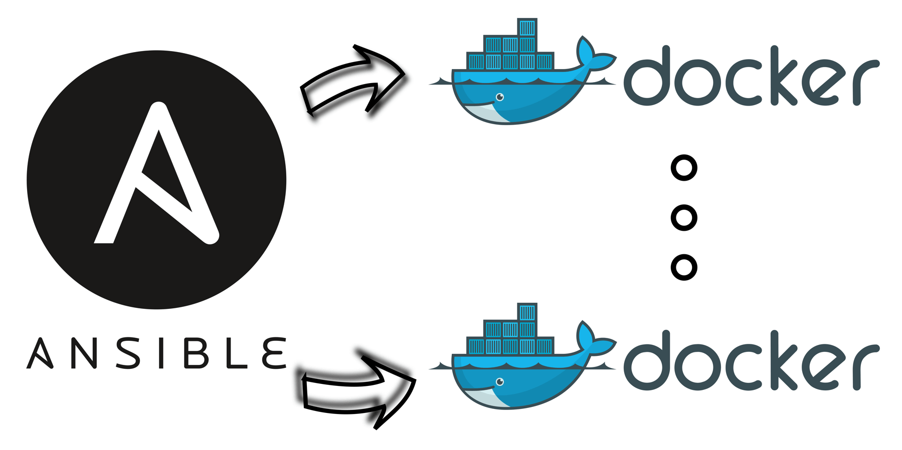

## Pre-requisites

The following components are required to proceed with this guide.

- One Ansible control node
- One or more Ansible managed nodes

For ease of understanding, this playbook has been divided into 6 sections.

---

## Section I - Defining scope of execution

```yml
- hosts: all
  become: true
```

- `hosts` - Target nodes for this playbook.
- `become` - Execute this playbook with elevated privilege. By default, `sudo` is used to become the `root` user, [*reference*](https://docs.ansible.com/ansible/latest/playbook_guide/playbooks_privilege_escalation.html#become-directives).

---

## Section II - Install required apt packages

```yml
tasks:
  - name: Install required apt packages
    apt:
      name:
        - ca-certificates
        - curl
        - gnupg
        - lsb-release
        - python3-pip
      state: latest
      update_cache: true
```

- `apt` - Manage apt packages, [*reference*](https://docs.ansible.com/ansible/latest/collections/ansible/builtin/apt_module.html).
  - `name` - List of packages to be installed, [*reference*](https://docs.ansible.com/ansible/latest/collections/ansible/builtin/apt_module.html#parameter-name).
    - `ca-certificates`, `curl`, `gnupg`, `lsb-release` - Requirement as per official [*Docker Docs*](https://docs.docker.com/engine/install/ubuntu/#set-up-the-repository).
    - `python3-pip` - Required to install a few python packages later.
  - `state` - Desired state of packages, [*reference*](https://docs.ansible.com/ansible/latest/collections/ansible/builtin/apt_module.html#parameter-state).
  - `update_cache` - Equivalent to running `apt-get update` before packages installation, [*reference*](https://docs.ansible.com/ansible/latest/collections/ansible/builtin/apt_module.html#parameter-update_cache).

---

## Section III - Download Docker GPG key

```yml
- name: Download Docker GPG key
  get_url:
    url: https://download.docker.com/linux/ubuntu/gpg
    dest: /etc/apt/keyrings/docker.gpg_armored
    checksum: sha256:1500c1f56fa9e26b9b8f42452a553675796ade0807cdce11975eb98170b3a570
```

- `get_url` - Download files from remote resource, [*reference*](https://docs.ansible.com/ansible/latest/collections/ansible/builtin/get_url_module.html).
  - `url` - Requirement as per official [*Docker Docs*](https://docs.docker.com/engine/install/ubuntu/#set-up-the-repository).
  - `dest` - Absolute path to download the file to, [*reference*](https://docs.ansible.com/ansible/latest/collections/ansible/builtin/get_url_module.html#parameter-dest).
  - `checksum` - SHA-256 checksum of Docker GPG key, **makes the file download operation [idempotent](https://docs.ansible.com/ansible/latest/reference_appendices/glossary.html#term-Idempotency)**, [*reference*](https://docs.ansible.com/ansible/latest/collections/ansible/builtin/get_url_module.html#parameter-checksum).

Additional information - Armored version of Docker GPG key works just fine. In fact, de-armor process simply [converts the key from *base64* to *binary* format](https://unix.stackexchange.com/a/623408).

---

## Section IV - Add Docker repository

```yml
- name: "Add Docker repository"
  apt_repository:
    filename: docker
    repo: "deb [arch=amd64 signed-by=/etc/apt/keyrings/docker.gpg_armored] https://download.docker.com/linux/ubuntu {{ ansible_lsb.codename }} stable"
    state: present
```

- `apt_repository` - Add specified repository into `/etc/apt/sources.list.d`, [*reference*](https://docs.ansible.com/ansible/latest/collections/ansible/builtin/apt_repository_module.html).
  - `filename` - `.list` extension will be automatically added, [*reference*](https://docs.ansible.com/ansible/latest/collections/ansible/builtin/apt_repository_module.html#parameter-filename).
  - `repo` - Source string of repository, [*reference*](https://docs.ansible.com/ansible/latest/collections/ansible/builtin/apt_repository_module.html#parameter-repo).
    - `{{ ansible_lsb.codename }}` - Leverage Ansible facts to dynamically obtain version of Ubuntu (e.g. `bionic`, `focal`, `jammy`), [*reference*](https://docs.ansible.com/ansible/latest/playbook_guide/playbooks_vars_facts.html#ansible-facts)
  - `state` - State of source string, [*reference*](https://docs.ansible.com/ansible/latest/collections/ansible/builtin/apt_repository_module.html#parameter-state).

---

## Section V - Install Docker and relevant packages

```yml
- name: Install Docker and relevant packages
  apt:
    name:
      - docker-ce
      - docker-ce-cli
      - containerd.io
      - docker-buildx-plugin
      - docker-compose-plugin
    state: latest
```

- `apt` - Manage apt packages, [*reference*](https://docs.ansible.com/ansible/latest/collections/ansible/builtin/apt_module.html).
  - `name` - List of packages to be installed, [*reference*](https://docs.ansible.com/ansible/latest/collections/ansible/builtin/apt_module.html#parameter-name).
    - `docker-ce`, `docker-ce-cli`, `containerd.io`, `docker-buildx-plugin`, `docker-compose-plugin` - Requirement as per official [*Docker Docs*](https://docs.docker.com/engine/install/ubuntu/#install-docker-engine).
  - `state` - Desired state of packages, [*reference*](https://docs.ansible.com/ansible/latest/collections/ansible/builtin/apt_module.html#parameter-state).

---

## Section VI - Install required Python packages

```yml
- name: Install required Python packages
  pip:
    name:
      - docker
      - docker-compose
```

- `pip` - Manage Python library dependencies, [*reference*](https://docs.ansible.com/ansible/latest/collections/ansible/builtin/pip_module.html).
  - `name` - List of Python library to be installed, [*reference*](https://docs.ansible.com/ansible/latest/collections/ansible/builtin/pip_module.html#parameter-name).
    - `docker` - Requirement for `community.docker` Ansible module, [*reference*](https://docs.ansible.com/ansible/latest/collections/community/docker/index.html).
    - `docker-compose` - Requirement for `community.docker.docker_compose` Ansible module, [*reference*](https://docs.ansible.com/ansible/latest/collections/community/docker/docker_compose_module.html).

---

## Wrapping up - playbook recap

Feel free to adapt this playbook to fit your environment/needs!

```yml
- hosts: all
  become: true

  tasks:
    - name: Install required apt packages
      apt:
        name:
          - ca-certificates
          - curl
          - gnupg
          - lsb-release
          - python3-pip
        state: latest
        update_cache: true

    - name: Download Docker GPG key
      get_url:
        url: https://download.docker.com/linux/ubuntu/gpg
        dest: /etc/apt/keyrings/docker.gpg_armored
        checksum: sha256:1500c1f56fa9e26b9b8f42452a553675796ade0807cdce11975eb98170b3a570

    - name: "Add Docker repository"
      apt_repository:
        filename: docker
        repo: "deb [arch=amd64 signed-by=/etc/apt/keyrings/docker.gpg_armored] https://download.docker.com/linux/ubuntu {{ ansible_lsb.codename }} stable"
        state: present

    - name: Install Docker and relevant packages
      apt:
        name:
          - docker-ce
          - docker-ce-cli
          - containerd.io
          - docker-buildx-plugin
          - docker-compose-plugin
        state: latest

    - name: Install required Python packages
      pip:
        name:
          - docker
          - docker-compose
```